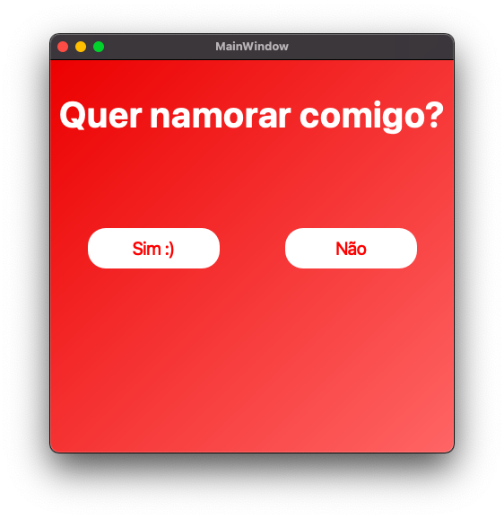

# Quer namorar comigo?

<h4 align="center">
  ☕ Code and coffee
</h4>

## Sobre o Projeto

Este projeto é uma aplicação divertida feita com Python e PySide6, criada para fazer um convite especial de uma forma interativa e fofa. A interface gráfica permite ao usuário escolher entre opções, tornando a experiência mais envolvente.

## Tecnologias Utilizadas

- [Python](https://python.org/)
- [PySide6](https://www.qt.io/qt-for-python)

## Passo a Passo de Como o Programa Foi Feito

1. **Planejamento da Ideia**
   - Pensei em criar um convite especial usando programação, tornando-o interativo e visualmente agradável.

2. **Configuração do Ambiente**
   - Instalei o Python 3 e o gerenciador de pacotes Pipenv para facilitar a gestão das dependências.
   - Comandos utilizados:
     ```
     pip3 install pipenv
     pipenv install
     pipenv shell
     ```

3. **Escolha da Biblioteca Gráfica**
   - Optei pelo PySide6 por ser moderno, multiplataforma e permitir criar interfaces bonitas com facilidade.

4. **Desenvolvimento da Interface**
   - Criei as telas principais usando os widgets do PySide6.
   - Implementei botões para as opções de resposta e personalizei o layout para ficar mais atrativo.

5. **Adição de Lógica Interativa**
   - Programei as ações dos botões para responder de acordo com a escolha do usuário, tornando a experiência divertida.

6. **Personalização Visual**
   - Adicionei imagens e estilos para deixar o convite mais bonito e especial.

7. **Testes**
   - Executei o programa diversas vezes para garantir que tudo funcionava corretamente e que a experiência estava agradável.

8. **Documentação**
   - Preparei este README para explicar o funcionamento e o processo de desenvolvimento do projeto.

## Screenshots

Tela de escolha  
<h1 align="center">
    
</h1>

Melhor decisão  
<h1 align="center">
    
</h1>

## Como Executar

1. Instale Python3, Pip3 e o Pipenv:
    ```
    pip3 install pipenv
    ```
2. No diretório do projeto, execute:
    ```
    pipenv install
    pipenv shell
    python3 main.py
    ```

## Como Contribuir

- Faça um fork deste repositório;
- Crie uma branch com sua feature: `git checkout -b minha-feature`;
- Faça commit das suas alterações: `git commit -m 'feat: Minha nova feature'`;
- Faça push para a sua branch: `git push origin minha-feature`;

---

Feito com ♥ por Vitória Fernandez